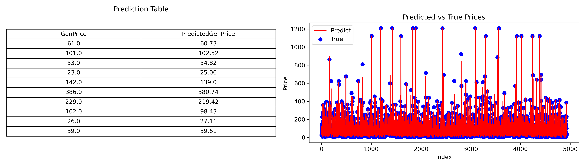
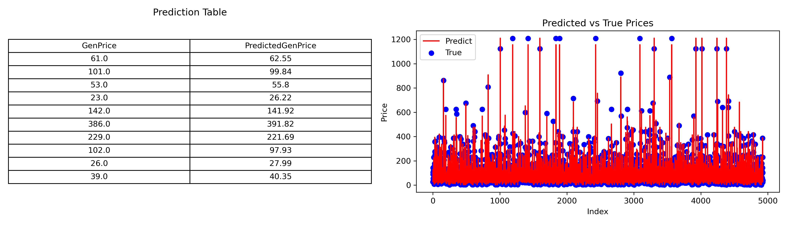
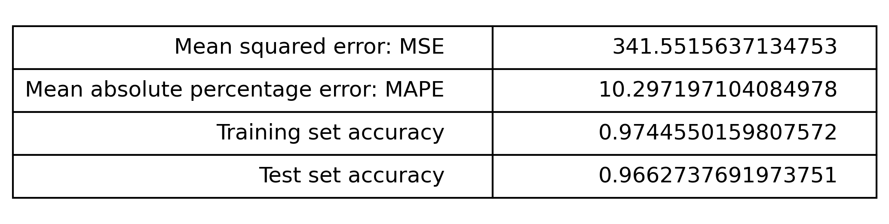
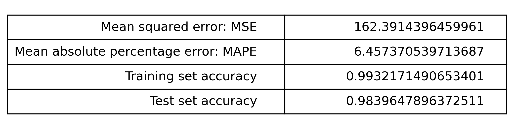
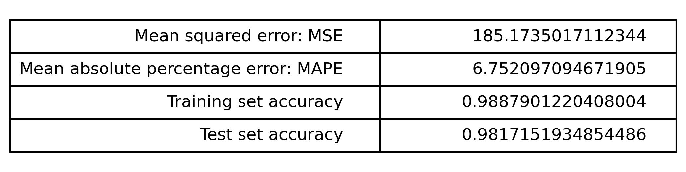

# Performance & Visualization

### Model Predictions vs Actual Values

* **Linear Regression**

  

* **Support Vector Regression (SVR)**

  

* **Feedforward Neural Network**

  

### Mean Squared Error (MSE) & Mean Absolute Percentage Error (MAPE)

* **Linear Regression**

  

* **Support Vector Regression (SVR)**

  

* **Feedforward Neural Network**

  

